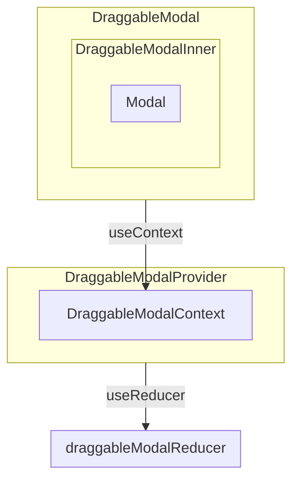

[toc]
# 项目结构



# 功能描述
提供一个拖动式的Modal组件

# 文件描述
+ DraggableModal: 包装DraggableModalInner，将单个Modal的状态传递给DraggableModalInner，避免过多Modal的状态的变化而触发多次渲染。
+ DraggableModalInner: 包装Modal，将回调（拖动、改变大小等回调）传递给Modal。
+ DraggableModalContext: 上下文，存储dispatch和state，state用于保存所有Modal的状态，dispatch用于触发事件（包括挂载、撤销挂载等）从而修改state。
+ draggableModalReducer: reducer，实现触发dispatch时的回调。
+ DraggableModalProvider: 用DraggableModalContext.Provider为下层组件提供上下文。

# 代码解析
## draggableModalReducer
首先为一个Modal定义一些状态，包括它的位置、长宽、是否可见、堆叠顺序：
```
export interface ModalState {
    x: number
    y: number
    width: number
    height: number
    zIndex: number
    visible: boolean
}
```

我们还需找个位置存储所有Modal的状态，定义如下，还额外存储最大的zIndex和窗口大小：
```
export interface ModalsState {
    maxZIndex: number
    windowSize: {
        width: number
        height: number
    }
    modals: {
        [key: string]: ModalState
    }
}
```
然后就可以定义reducer了，可拖动式的Modal会涉及多个行为，针对不同的行为，我们需要设置不同的状态转移，具体如下表：
|     行为     |     描述     |                      状态转移                      |
| :----------: | :----------: | :------------------------------------------------: |
|    resize    |   改变大小   |             zIndex++,设置width,height              |
|     drag     |     拖动     |                  zIndex++,设置x,y                  |
|     show     |     显示     | zIndex=maxZIndex+1,visable=true,调整位置至窗口中央 |
|    focus     |   获得焦点   |                 zIndex=maxZIndex+1                 |
|     hide     |     隐藏     |                   visable=false                    |
|    mount     |     挂载     |       zIndex=maxZIndex+1,调整位置至窗口中央        |
|   unmount    |   解除挂载   |                  删除该Modal状态                   |
| windowResize | 窗口大小变化 |                调整Modal位置和长宽                 |

## DraggableModalContext
创建一个上下文，存储state和dispatch，state用于存储所有Modal的状态，dispatch是useReducer生成的dispatch

## DraggableModalProvider
利用useReducer生成state和dispatch:
```
    const [state, dispatch] = useReducer(draggableModalReducer, initialModalsState)
```

window注册窗口大小变化的监听器，回调为触发windowResize的函数
```
    useEffect(() => {
        if (typeof window !== 'object') {
            return
        }
        const onResize = (): void => dispatch({ type: 'windowResize', size: getWindowSize() })
        window.addEventListener('resize', onResize)
        onResize()
        return () => window.removeEventListener('resize', onResize)
    }, [dispatch])
```

最后为子组件提供上下文，包括useReducer生成的state和dispatch。

## DraggableModal
DraggableModal生成Modal的唯一Id，获取DraggableModalContext上下文，从上下文获取单个Modal的状态，最后将id，Modal状态，dispatch等传递给DraggableModalInner

## DraggableModalInner
为了尽可能减少渲染的次数，作者使用memo来进行优化：
```
export const DraggableModalInner = memo(DraggableModalInnerNonMemo)
```
传递给DraggableModalInner的属性没有变化时，就不会重新渲染DraggableModalInner。<br><br>
再进到DraggableModalInnerNonMemo内部看看:<br>
针对不同的行为和状态的变化，作者利用useEffect和组件回调来触发事件。<br>

挂载完组件后触发事件mount:
```
    useEffect(() => {
        dispatch({ type: 'mount', id, intialState: { initialWidth, initialHeight } })
        return () => dispatch({ type: 'unmount', id })
    }, [dispatch, id, initialWidth, initialHeight])

```

可见属性变化后触发事件show或hide:
```
    useEffect(() => {
        if (visible !== visiblePrevious) {
            if (visible) {
                dispatch({ type: 'show', id })
            } else {
                dispatch({ type: 'hide', id })
            }
        }
    }, [visible, visiblePrevious, id, dispatch])
```

此外还需要设置获得焦点、拖动、改变大小等回调。<br>
回调函数一般来说在每次渲染的时候都会重新生成一遍，如果回调函数和渲染前的一样，其实就没有必要重新生成。所以，这种情况下，我们可以进一步优化，可以利用好React Hook提供的useMemo和useCallback。

以获取焦点的回调为例：
```
    const onFocus = useCallback(() => dispatch({ type: 'focus', id }), [id, dispatch])

```
当id和dispatch不变时，就不会重新生成onFocus函数。<br><br>
Modal的title也可以用useMemo进行优化： 
```
    const titleElement = useMemo(
        () => (
            <div
                className="ant-design-draggable-modal-title"
                onMouseDown={onMouseDrag}
                onClick={onFocus}
            >
                {title}
            </div>
        ),
        [onMouseDrag, onFocus, title],
    )
```
当onMouseDrag, onFocus, title不变时，titleElement就不会重新计算。<br><br>
其他回调类似，用useCallback减少生成次数。最后将回调和属性传递给ant-design的Modal。

## 一些小功能
### clampDrag 
根据窗口大小和Modal的大小来计算出最大的X,Y，以确保拖动时Modal在窗口内部。

### clampResize
同clampDrag，确保拉伸时不会拉出到窗口外。

### getModalState
该函数需要传递一个id值，如果该id对应的Modal的状态不存在，则返回初始的状态。

### [usePrevious](https://blog.logrocket.com/how-to-get-previous-props-state-with-react-hooks/)
该自定义Hook利用了useEffect和useRef的特性，useRef能确保返回值不会变化（无论渲染多少次），除非显式地通过ref.current进行赋值；useEffect的回调在组件渲染完成的时候才会触发，所以能够让usePrevious返回渲染完成前的值，即旧值。

### useDrag

### useResize
