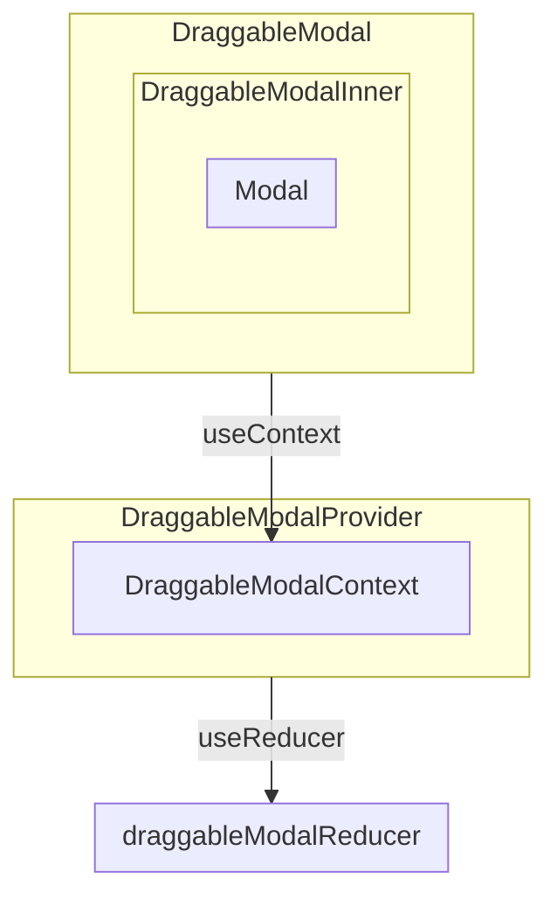

[toc]
# 项目结构



# 文件描述
DraggableModal: 包装DraggableModalInner，将单个Modal的状态传递给DraggableModalInner，避免过多Modal的状态的变化而触发多次渲染。

DraggableModalInner: 包装Modal，将回调（拖动、改变大小等回调）传递给Modal。
DraggableModalContext: 上下文，存储dispatch和state，state用于保存所有Modal的状态，dispatch用于触发事件（包括挂载、撤销挂载等）从而修改state。
draggableModalReducer: reducer，实现触发dispatch时的回调。
DraggableModalProvider: 用DraggableModalContext.Provider为下层组件提供上下文，

# 代码解析
## draggableModalReducer
首先为一个Modal定义一些状态，包括它的位置、长宽、是否可见、堆叠顺序：
```
export interface ModalState {
    x: number
    y: number
    width: number
    height: number
    zIndex: number
    visible: boolean
}
```

我们还需找个位置存储所有Modal的状态，定义如下，还额外存储最大的zIndex和窗口大小：
```
export interface ModalsState {
    maxZIndex: number
    windowSize: {
        width: number
        height: number
    }
    modals: {
        [key: string]: ModalState
    }
}
```

然后就可以定义reducer了，

## 一些小功能
### draggableModalReducer
#### clampDrag 

#### clampResize

